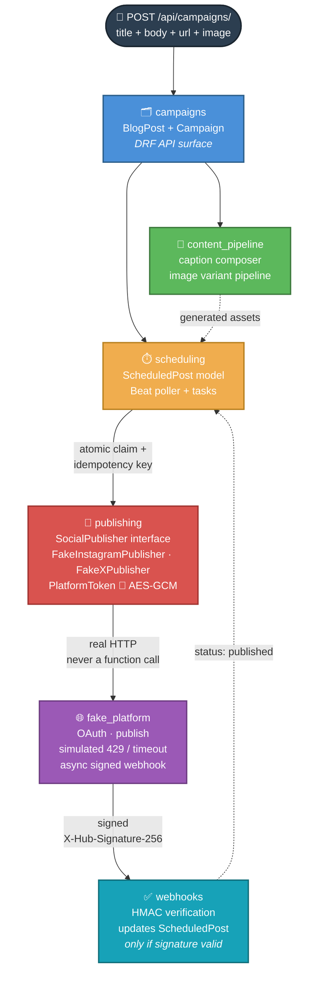

<div align="center">

# 🚀 FlyRank Capstone — Social Campaign Publisher

**One blog post in. A scheduled, multi-platform social campaign out.**
Reliability engineering wearing a marketing costume.


</div>

---

## 🧠 The idea, in one breath

The hard part was never *calling* an API. It's building a publishing
system that survives **duplicate requests, network failures, rate
limits, and crashed workers** — with webhook-verified status tracking,
end to end. Everything runs against a self-built fake social platform.
No real accounts, ever.

<div align="center">

| 📝 Input | ⚙️ Engine | 📤 Output |
|:---:|:---:|:---:|
| One blog post | Django + Celery + Postgres/Redis | Two verified, published social posts |

</div>

---

## ✅ What it actually does

```
1. POST /api/campaigns/  ──▶  one blog post (title, body, url, image)
2. Caption Composer      ──▶  shared core + platform-specific fragment
3. Image Variant Pipeline──▶  Instagram 1080×1080 · X 1600×900
4. Scheduler              ──▶  deterministic idempotency key, atomic claim
5. SocialPublisher        ──▶  429/backoff-aware, safe to call twice
6. Webhook Receiver       ──▶  HMAC-verified before status ever changes
7. Crash recovery         ──▶  stale claims reclaimed, nothing lost, nothing duplicated
```

| Guarantee | How |
|---|---|
| 🔁 No duplicate posts | Deterministic idempotency key + atomic `UPDATE` claim |
| 🚦 Respects rate limits | Honors real `Retry-After`, exponential backoff otherwise |
| 💥 Survives crashes | Stale-claim reclaim on every Beat poll cycle |
| 🔐 Tokens never in plaintext | AES-GCM, random nonce, never logged |
| ✍️ Webhook-verified state | Forged signature → `400`, state untouched |

---

## 🏗️ Architecture

> 💡 **This diagram is interactive on GitHub** — hover over it and use
> the zoom/pan controls that appear in the corner to explore it up close,
> just like an image.



<sub>Solid arrows = the real request path · dotted arrows = data/status
flowing back the other way. Each colored block is one Django app owning
exactly one layer.</sub>

Six Django apps, each owning **one layer**. `publishing/adapters.py` is
the *only* code in the whole project that knows `fake_platform`'s HTTP
contract (documented in [`FAKE_PLATFORM_CONTRACT.md`](./FAKE_PLATFORM_CONTRACT.md))
— everything upstream depends only on the `SocialPublisher` interface.

📄 Full data model + design reasoning → [`DESIGN.md`](./DESIGN.md)

---

## ⚡ Quick start

### 🐳 Option A — Docker (recommended, matches production)

```bash
docker compose up --build
```

That's it — one command spins up Postgres, Redis, the Django server, the
Celery worker, and Celery Beat, all wired together.

```bash
docker compose exec web python manage.py seed_demo
```

Watch the logs — within 15 seconds the seeded campaign publishes itself
to **both platforms**, automatically, with zero manual triggers.

```bash
curl http://localhost:8000/api/campaigns/<id-from-seed_demo-output>/
```

<details>
<summary>🔧 First-time <code>.env</code> setup</summary>

```bash
cp .env.example .env
```
Then generate real values and paste them in:
```bash
python -c "from django.core.management.utils import get_random_secret_key; print(get_random_secret_key())"
python -c "import secrets; print(secrets.token_hex(32))"
python -c "from cryptography.hazmat.primitives.ciphers.aead import AESGCM; import base64; print(base64.b64encode(AESGCM.generate_key(bit_length=256)).decode())"
```
⚠️ If your generated `DJANGO_SECRET_KEY` contains a `$`, escape it as
`$$` in `.env` — Docker Compose treats a lone `$` as a variable reference.

</details>

### 🖥️ Option B — Local dev, no Docker

```bash
python -m venv venv
venv\Scripts\activate
pip install -r requirements.txt
python manage.py migrate
python manage.py seed_demo
python manage.py runstack     # server + worker + beat, one terminal
```

If `runstack` doesn't play nicely on your machine, fall back to three
terminals:
```bash
python manage.py runserver
celery -A config worker -l info
celery -A config beat -l info
```

---

## 🧪 Tests

```bash
python manage.py test                          # local
docker compose exec web python manage.py test   # in Docker
```

<div align="center">

**38 / 38 passing** — verified on both SQLite (local dev) and
**real Postgres + Redis (Docker)**.

</div>

Covers image dimensions, caption platform-awareness, encryption,
adapter HTTP handling, an **idempotency hammer** run directly against
the live `fake_platform` view (10 duplicate requests → exactly 1 post),
forged-webhook rejection, and scheduling durability (crash simulation →
automatic recovery, zero duplicates).

📊 Full per-checklist-item breakdown with pasted output →
[`EVIDENCE.md`](./EVIDENCE.md)

🎬 6-minute guided walkthrough → [`DEMO_SCRIPT.md`](./DEMO_SCRIPT.md)

---

## ⚠️ Known limitations

Documented on purpose, not hidden:

- **Two run modes, both real.** Docker (Postgres + Redis) is the primary
  path; `runstack` (SQLite + filesystem broker) is a documented local-dev
  fallback. Nothing in the app code branches on which one is active —
  `CELERY_BROKER_URL` and `DATABASES` come only from settings.
- **Own fake platform, not the provided starter.** The
  `starters/challenge-5-social/` link in the brief was unreachable, so
  `fake_platform` is a self-built equivalent, contract documented in
  [`FAKE_PLATFORM_CONTRACT.md`](./FAKE_PLATFORM_CONTRACT.md).
- **Image pipeline uses simple center-crop** — assumes the subject is
  roughly centered. Real subject-detection/focal-point safe-zoning is a
  documented v2, not a silent gap.
- **The organic random 429** (~1-in-8 publish requests) is controllable
  via `FAKE_PLATFORM_SIMULATE_RANDOM_429` — off in deterministic tests,
  on by default so the retry path fires under normal conditions too.

---

## 🤖 AI usage

Built with AI (Claude) assistance throughout, logged transparently in
[`BUILDLOG.md`](./BUILDLOG.md) — including the real bugs Claude's first
passes got wrong (a missing `load_dotenv()`, a filesystem-broker folder
mismatch, an infinite reclaim loop found during demo rehearsal, and a
missing `redis` package that broke Docker) — all found by actually
running the code, not by review.

<div align="center">

*Reliability first. Everything else is decoration.*

</div>